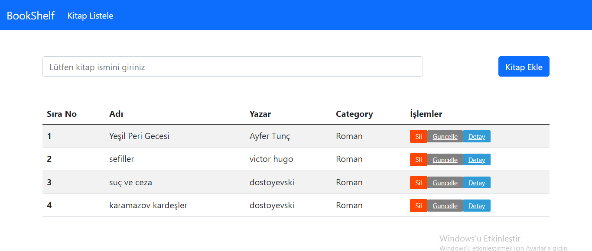
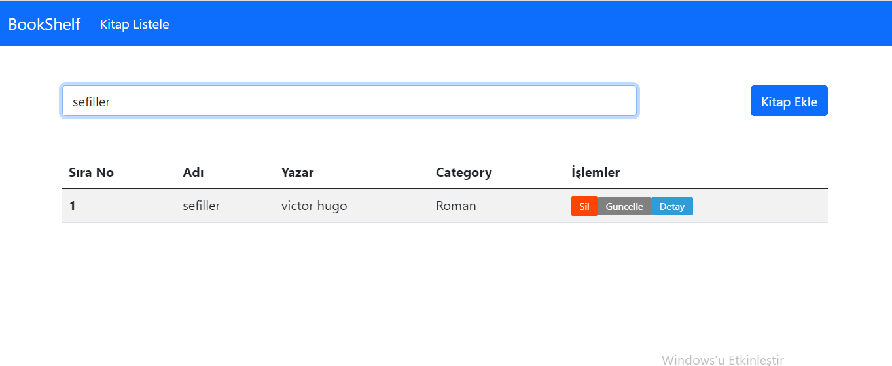
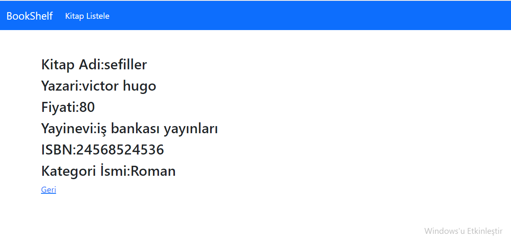
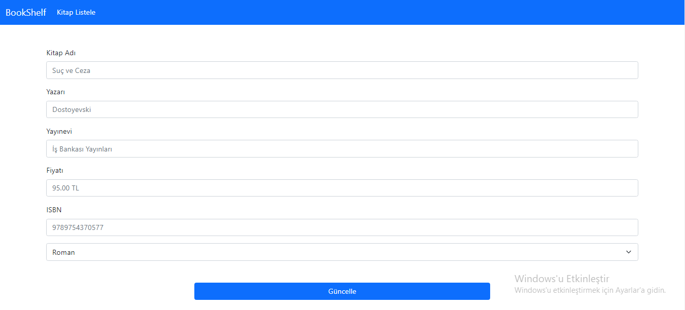
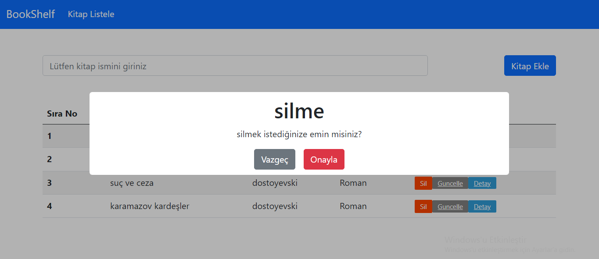

# Kütüphane Uygulaması

<h1>Kullanılan Teknolojiler</h1>

Bu projede React,Redux,React-Router-Dom,Bootstrap kullanılmıştır. Veriler Json-Server kullanılarak oluşturduğum fake-server'a api aracılığıyla kaydedilip gerektiğinde de güncelleme esnasında silinmektedir. Projede, React'ın bütün özelliklerinin aynı uygulamada kullanılması yönüyle önemli bir proje olmuştur. Proje ile alakalı resimleri sunuyorum.

